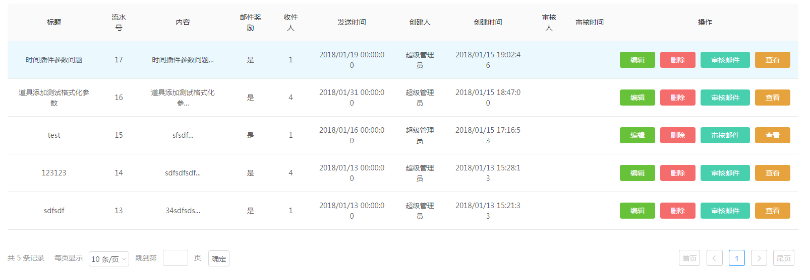
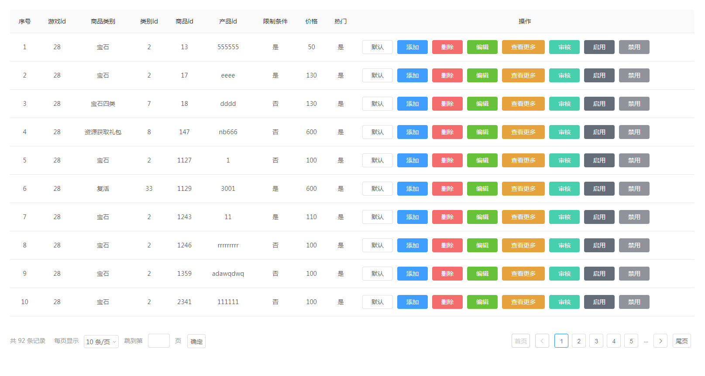

# vue-table-pagination
vue2封装的table联动组件

[](https://www.travis-ci.org/jackieli123723/vue-table-pagination)
[](https://coveralls.io/github/jackieli123723/vue-table-pagination?branch=master)

## Install with npm

```
Installing

npm install --save vue-table-pagination

Import

import Vue from 'vue';
import VueTablePagination from 'vue-table-pagination';
Vue.use(VueTablePagination);
```

# 西门互联分页组件
可自定义配置和分页可fork自行修改

```
<VueTablePagination
        @gmChangePageButton="gmChangePageButton"
        @gmChagePageSize="gmChagePageSize"
        :gmCurrentPage="page"
        :gmTotalPage="totalPage"
        :gmCanJump="true"
        :gmCanChoose="true"
        :gmTableLists="gmTableLists"
        :gmTableThLists="gmTableThLists"
        :gmIsIndex="true"
        @gmPerEmitClick="gmPerEmitClick"
        :gmTableWidth="0"
        :gmTimeStampType="63"
></VueTablePagination>
gmChangePageButton -- 按钮改变分页
gmChagePageSize --每页显示多少条
page -- 当前高亮锚点
totalPage -- 总页数
gmCanJump --是否跳转
gmCanChoose -- 是否改变分页条数
gmTableLists --tbody数据
gmTableThLists --theader数据
gmIsIndex --开启索引
gmPerEmitClick --table中的按钮操作
gmTableWidth --table宽度
gmTimeStampType --时间参数
```

## 效果图截图



